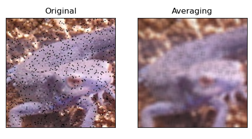
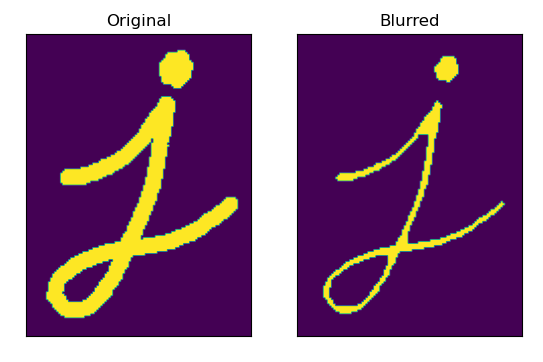
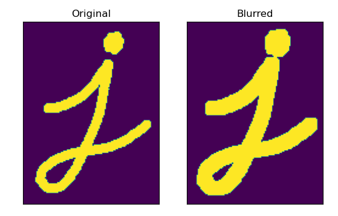
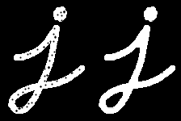
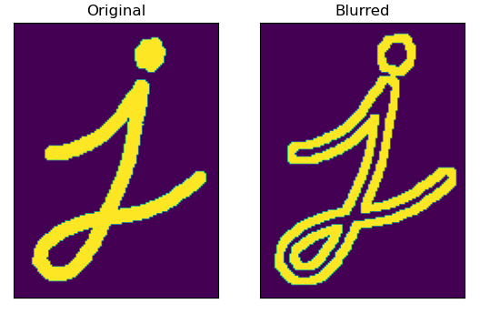
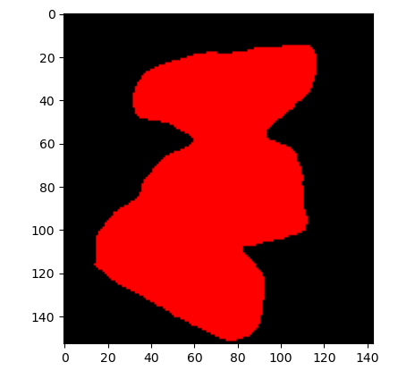
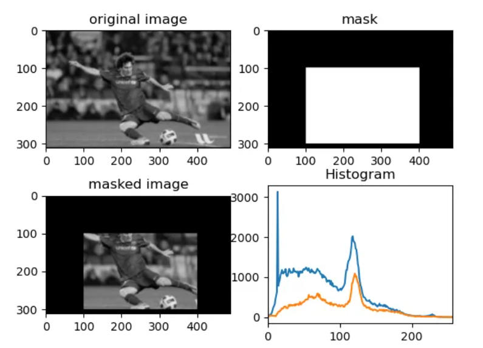
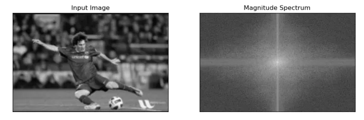

# 图像专题

## Vision Transformer

Vision Transformer将CV和NLP领域知识结合起来，**对原始图片进行分块，展平成序列，输入进原始Transformer模型的编码器Encoder部分**，最后接入一个全连接层对图片进行分类。在大型数据集上表现超过了当前SOTA模型.


## 图像处理的基本操作

### 图像处理的基本操作（一）：颜色空间变换、几何变换、阈值、平滑降噪

1. 改变颜色空间

   BGR↔灰色和BGR↔HSV。对于BGR→灰度转换，因为RGB不适合指定同一色系颜色范围，因此首先将颜色空间转换为HSV，然后约束HSV空间中蓝色的范围，提取出蓝色的物体，通过逐像素逻辑与操作，实现蓝色物体的提取。

   ```
   import cv2 as cv
   import numpy as np
   cap = cv.VideoCapture(0)
   while(1):
       # 读取帧
       _, frame = cap.read()
       # 转换颜色空间 BGR 到 HSV
       hsv = cv.cvtColor(frame, cv.COLOR_BGR2HSV)
       # 定义HSV中蓝色的范围
       lower_blue = np.array([110,50,50])
       upper_blue = np.array([130,255,255])
       # 设置HSV的阈值使得只取蓝色
       mask = cv.inRange(hsv, lower_blue, upper_blue)
       # 将掩膜和图像逐像素逻辑与操作
       res = cv.bitwise_and(frame,frame, mask= mask)
       cv.imshow('frame',frame)
       cv.imshow('mask',mask)
       cv.imshow('res',res)
       k = cv.waitKey(5) & 0xFF
       if k == 27:
           break
   cv.destroyAllWindows()
   ```

   补充：如何找到要追踪的HSV值？

   使用相同的函数**cv.cvtColor()**。只需传递你想要的BGR值，例如，要查找绿色的HSV值，使用以下代码：

   ```
   green = np.uint8([[[0,255,0 ]]])
   hsv_green = cv.cvtColor(green,cv.COLOR_BGR2HSV)
   print( hsv_green )
   ```

2. 图像的几何变换

   - 学习将不同的几何变换应用到图像上，如平移、旋转、仿射变换等。
   - 使用函数: cv.getPerspectiveTransform

3. 图像阈值

   对于每个像素，如果像素值小于固定阈值，则将其设置为0，否则将其设置为最大值。函数cv.threshold用于应用阈值。第一个参数是源图像，它应该是灰度图像。第二个参数是阈值，用于对像素值进行分类。第三个参数是分配给超过阈值的像素值的最大值。第四个参数为阈值类型

4. 图像平滑

   

### 图像处理的基本操作（二）：形态学转换、图像梯度、canny边缘检测、图像金字塔

1.形态学转换

|          |         |            |            |                |          |          |              |
| -------- | ------- | ---------- | ---------- | -------------- | -------- | -------- | ------------ |
| 1.1 腐蚀 | 1.2膨胀 | 1.3 开操作 | 1.4 闭操作 | 1.5 形态学梯度 | 1.6 顶帽 | 1.7 黑帽 | 关于结构元素 |

形态变换是基于图像形状的简单操作，一般在二进制图像上进行结构元素匹配操作，其核心是决定操作性质的**结构元素**或者**内核**。

1.1 腐蚀
原理：在原图中滑动结构元素，寻找与结构元素完全匹配的部分，即原始图像中的一个origin像素(无论是1还是0)只有当内核下的所有像素都是1时才被认为是1，否则它就会被侵蚀(变成0)。
作用：消除边界、向内收缩



1.2膨胀
原理它与侵蚀正好相反。如果内核下的至少一个像素为“ 1”，则origin元素为“ 1”。
作用：增加图像中的白色区域或增加前景对象的大小。
函数：cv.dilate



1.3 开操作

- 原理：先腐蚀，后膨胀
- 作用：平滑轮廓，消除噪声，消除边缘粗糙，断开狭窄间断
- 函数：`cv.morphologyEx`


1.4 闭操作

- 原理：先膨胀，后腐蚀

- 作用：现充细小空洞，消除狭窄间断

- 函数：`cv.morphologyEx`

  

1.5 形态学梯度

- 原理：实质上为图中膨胀图和腐蚀图之差
- 作用：结果看起来像对象的轮廓
- 函数：`cv.morphologyEx`



1.6 顶帽

- 原理：输入图像和图像开运算之差
- 作用：用于背景提取;分离比邻近点亮一些的斑块。当一幅图像具有大幅的背景的时候，而微小物品比较有规律的情况下，可以使用顶帽运算进行背景提取。

1.7 黑帽

- 原理：输入图像和图像闭运算之差。
- 作用：黑帽运算的效果突出了比原图轮廓周围的区域更暗的区域，且与选择的卷积核大小有关，所以黑帽运算用来分离比邻近点暗一些的斑块。

2 图像梯度（边缘检测）

|               |                 |                    |                         |
| ------------- | --------------- | ------------------ | ----------------------- |
| 2.1 Sobel算子 | 2.2 Scharr 算子 | 2.3 Laplacian 算子 | 2.4 Canny边缘检测
目标： |

学习查找图像梯度、边缘: Sobel、Scharr、Laplacian算子
函数：cv.Sobel()，cv.Scharr()，cv.Laplacian()等


3.图像金字塔

|               |                   |
| ------------- | ----------------- |
| 1）高斯金字塔 | 2）拉普拉斯金字塔 |

图像金字塔是图像中多尺度表达的一种，主要用于图像分割。

在某些情况下，我们需要使用不同分辨率的（相同）图像。例如，当在图像中搜索某些东西（例如人脸）时，我们不确定对象将以多大的尺寸显示在图像中，因此需要创建一组具有不同分辨率的相同图像，并在所有图像中搜索对象。

### 图像处理的基本操作（三）：轮廓

定义：连接具有相同颜色或强度的所有连续点的曲线。



### 图像处理的基本操作（四）：直方图方法

直方图可以让你了解总体的图像像素强度分布，其X轴为像素值（一般范围为0~255），在Y轴上为图像中具有该像素值像素数。

直方图的作用： 通过直方图可以直观地i奥杰图像的对比度、亮度、强度分布等。

我们使用了cv.calcHist()来查找整个图像的直方图。如果你想找到图像某些区域的直方图呢?只需创建一个掩码图像，在你要找到直方图为白色，否则黑色。然后把这个作为掩码传递。

```python
import numpy as np
import cv2 as cv
import matplotlib.pyplot as plt

img = cv.imread('messi.png') #BGR
#创建掩码
mask=np.zeros(img.shape[:2],np.uint8)
mask[100:300,100:400]=255
masked_img=cv.bitwise_and(img,img,mask=mask)
# 计算掩码区域和非掩码区域的直方图
# 检查作为掩码的第三个参数
hist_full = cv.calcHist([img],[0],None,[256],[0,256])
hist_mask = cv.calcHist([img],[0],mask,[256],[0,256])
plt.subplot(221), plt.imshow(img, 'gray'),plt.title("original image")
plt.subplot(222), plt.imshow(mask,'gray'),plt.title("mask")
plt.subplot(223), plt.imshow(masked_img, 'gray'),plt.title("masked image")
plt.subplot(224), plt.plot(hist_full), plt.plot(hist_mask),plt.title("Histogram")
plt.xlim([0,256])
plt.show()
```



什么是直方图均衡化
考虑这样一个图像，它的像素值仅局限于某个特定的值范围。例如，较亮的图像将把所有像素限制在高值上。但是一幅好的图像会有来自图像所有区域的像素。因此，您需要将这个直方图拉伸到两端，提高图像的颜色范围。这通常会提高图像的对比度。

均衡化操作由以下式子定义。是总的像素数；是像素点的最大取值（在这里是）；表示取值为的累积分布函数： $$ Z' = \frac{Z_{max}}{S} \ \sum\limits_{i=0}^z\ h(i) $$


### 图像处理的基本操作（五）：傅里叶变换与模板匹配

二维傅里叶变换用于分析图像的频率特性，对采样的离散信号进行傅里叶变换，得到周期性的N点DFT。可以将图像视为在两个方向上采样的信号。因此，在X和Y方向都进行傅立叶变换，可以得到图像的频率表示。

更直观地说，对于正弦信号，如果幅度在短时间内变化如此之快，则可以说它是高频信号。如果变化缓慢，则为低频信号。您可以将相同的想法扩展到图像。图像中的振幅在哪里急剧变化？在边缘点或噪声。因此，可以说边缘和噪声是图像中的高频内容。如果幅度没有太大变化，则它是低频分量。


