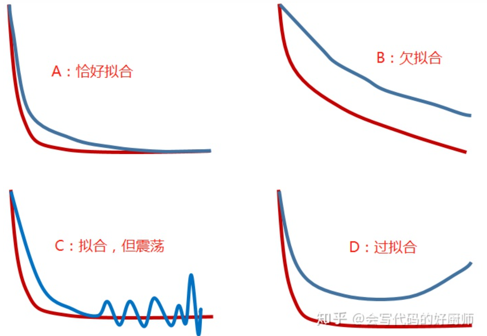
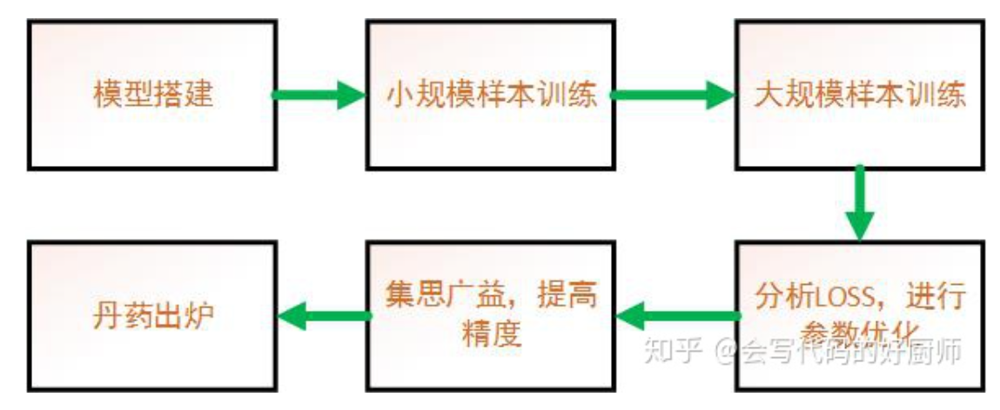

# 一、神经网络问题

## 1、神经网络可视化？

tensorboard --logdir ./任务文件夹/runs --port 需要开放的端口号PORT

然后在浏览器里面打开172.16.250.6:PORT 就能看到tensorboard的界面哈

外网10.25.0.11:6006

对应路径输入tensorboard --logdir runs --port 6006


## 2、数据读取失败可能的原因？

1、图片是否可以读取shape，图像是否正常尺寸（1，1）

2、标签是否格式准确

3、cpu物理内存free -h，是否关一些jupyter，或者决定是否使用多线程worker， 改变图片的尺寸640。


## 3、网络不收敛可能的解决方法？

1、增大数据量

2、加大网络


## 4、图像数据取图像

1、dwb_db_ai_center_tb_ai_serber_running_results_o_a_d 跑过模型的所有客户分数。

2、dim_user_basic用户中心全量表

3、en_dw.cros_log_tmp表里extra有filename


## 5、训练模型报错image file is truncated

原因：图片错误

解决：Image.open().load()找到路径，删掉图片


## 6、图片报错

```
find ./ -size -1k -name '*.jpg'|xargs rm
```


## 7、训练错误mat1 dim 1 must match mat2 dim 0

```python
#原因：原本网络是以48*48的图片大小作为输入，后面resize成224*224的大小进行输入，所以网络那边参数也要改一下。

#解决：为了确定哪一层网络层出现问题，那就debug一步一步走，后面发现是第一层全连接出现问题。那就打印一下输入全连接层是feature map的大小


        self.fc1 = nn.Linear(2000, 500)  # 输入通道数是2000，输出通道数是500
        ……
       （此处省略多行代码）
        ……
        print(out.size()) # 这里打印看下输入全连接层前feature map的大小
        out = self.fc1(out) 
 
#打印结果为：torch.Size([256, 233280])。
 
那就简单了，修改下全连接层的声明
        self.fc1 = nn.Linear(233280, 500)  # 输入通道数改成233280，输出通道数是500
```


## 8、debug工具-PySnooper

```
import pysnooper
 
@pysnooper.snoop()
```

## 9、Tensorboard

Pytorch要怎么可视化

1、SummaryWriter()

这个函数用于创建一个tensorboard文件，其中常用参数有：

- log_dir：tensorboard文件的存放路径
- flush_secs：表示写入tensorboard文件的时间间隔

```
writer = SummaryWriter(log_dir='logs',flush_secs=60)
```

2、writer.add_graph()

这个函数用于在tensorboard中创建Graphs，Graphs中存放了网络结构，其中常用参数有：

- model：pytorch模型
- input_to_model：pytorch模型的输入

```
if Cuda:
    graph_inputs = torch.from_numpy(np.random.rand(1,3,input_shape[0],input_shape[1])).type(torch.FloatTensor).cuda()
else:
    graph_inputs = torch.from_numpy(np.random.rand(1,3,input_shape[0],input_shape[1])).type(torch.FloatTensor)
writer.add_graph(model, (graph_inputs,))
```

3、writer.add_scalar()

这个函数用于在tensorboard中加入loss，其中常用参数有：

- tag：标签，如下图所示的Train_loss

- scalar_value：标签的值

- global_step：标签的x轴坐标

- ```
  writer.add_scalar('Train_loss', loss, (epoch*epoch_size + iteration))
  ```

4、writer.add_figure

可以画混淆矩阵

```
writer.add_figure(f'{phase}/{phase}_cm', 
                          figure=plot_confusion_matrix(
                              confusion_matrix(y_true, y_pred), 
                              classes=CATEGORIES, 
                              is_normalize=False,
                              title=f'{phase} confusion matrix'
                          ),
                          global_step=epoch)
```

5、tensorboard 可视化

在完成tensorboard文件的生成后，可在命令行调用该文件，tensorboard网址。
具体代码如下：

```
tensorboard --logdir=D:\Study\Collection\Tensorboard-pytorch\logs --port 7006
```


## 10.wing loss是人脸关键点回归方式的loss

预测值的范围为0-1。 wing loss在error特别大时，梯度为常数，当error比较小时，梯度比L1和MSE都要大。


## 11.pytorch加载模型torch.load报cuda out of memory解决方案

```
当服务器中有多张显卡时可能会出现这个问题。
模型参数加载：

model_recover = torch.load(args.model_recover_path)
1
报错如下：

RuntimeError: CUDA error: out of memory
1
原因：
当使用torch.load加载模型参数时，会默认加载在第一块GPU0上，当GPU0没有在使用时，问题不大，但是显存被占满时这时候就加载不了了。
解决方法：

model_recover = torch.load(args.model_recover_path, map_location='cuda:0')
```


## 12.训练出来的网络不管跑什么图片结果都一样？

解决：lr太大，梯度消失，把lr调小一些。


## 13、神经网络调参技巧

```
1. 哪些参数需要调？（what）
2. 什么时候需要调参？(when)
3. 如何调参？(how)
4. 训练网络的一般过程是什么？(recap)
```

**一、哪些参数需要调？（what）**

**需要调参的都是超参数，也就是人为设定的参数！**因此，这个问题还可以换成神经网络中有哪些超参数？主要从两个方面来看：

- **网络设计相关的参数**：网络层数、不同层的类别和搭建顺序、隐藏层神经元的参数设置、LOSS 的选择、正则化参数
- **训练过程相关的参数：**网络权重初始化方法、学习率、迭代次数、小批量数据的规模

**二、什么时候需要调参？(when)**

通常网络训练的结果一般表现为以下五种情况：过拟合、欠拟合、恰好拟合，趋于收敛但一直在震荡以及完全不收敛。

欠拟合、恰好拟合、过拟合的现象，图像表示如下：



**3.1 恰好拟合的情况：A 图**

恰好拟合：训练集和测试集的LOSS都已经收敛，且很接近，说明模型能够很好地拟合训练样本和测试样本的分布，泛化能力强，简单讲就是在训练集和测试集上效果都很好。

这个时候效果都这么好了，还需要调参吗？答案是：需要调参！ 主要集中在网络设计方面的调参，在工程项目上，要达到同样的效果，我们需要考虑更小、更轻量型的网络结构，简言之就是为了节省成本（计算量===功耗，网络大小===内存）

这时候可以考虑调节以下参数：

- 减少网络层数
- 减少不同的层的参数，主要是卷积核的数量
- 考虑深度可分离这样的轻量型卷积结构
- 适当调大 batchsize

**3.2 欠拟合的情况：B 图**

欠拟合：从LOSS曲线上看，训练集和测试集从趋势上还没有收敛！

这时候可以考虑调节以下参数：

- 增加优化数据集，进行数据清洗
- 加大训练迭代次数，有可能是网络还没训练完
- 进一步衰减调小学习率
- 添加更多的层，也有可能是网络容量不够
- 去掉正则化约束的部分，l1\l2正则（正则主要是为了防止过拟合）
- 加入BN层加快收敛速度
- 增加网络的非线性度（ReLu）
- 优化数据集，进行数据清洗

**3.3 过拟合的情况：D 图**

过拟合：从LOSS曲线上看，都趋向收敛，但是测试集上的LOSS很高，甚至出现回升现象。说明模型泛化能力很差，有可能训练集和测试集数据分布不一致，更加可能的是模型太复杂。

这时候可以考虑调节以下参数：

- 增加样本数量，训练样本太少或者说小样本问题，很容易导致过拟合。推荐阅读博主的另一篇文章，链接地址：[https://mp.weixin.qq.com/s/6hzGMOMrG2w-54c4zyRj5g](https://link.zhihu.com/?target=https%3A//mp.weixin.qq.com/s/6hzGMOMrG2w-54c4zyRj5g)
- 数据增强，可以参考博主的另一篇博客《炼丹笔记之数据增强》[https://mp.weixin.qq.com/s/KfiggFTzDRMjQWzvFd_C_g](https://link.zhihu.com/?target=https%3A//mp.weixin.qq.com/s/KfiggFTzDRMjQWzvFd_C_g)
- 早停法（Early stopping），从LOSS不在下降的地方拿到模型，作为训练好的模型
- 增加网络的稀疏度
- 降低网络的复杂度（深度）
- L1 regularization
- L2 regulariztion
- Dropout
- 适当降低Learning rate
- 适当减少epoch的次数

**3.4 趋于收敛但是震荡的情况：C 图**

我们还提到了一种情况，就是网络在训练集上已经趋于收敛，但是在测试集上存在很严重的LOSS震荡的情况，这时候可以考虑调节以下参数：

- 训练集和测试集分布是否存在较大的差异
- 是否由于数据增强做的太过分了
- 学习率是不是还很高？如果是，降低学习率
- 测试集LOSS的计算是基于单个batch还是整个测试集？（一定要基于整个测试集来看）
- 网络是否存在欠拟合的可能，如果欠拟合参考上面欠拟合的方法

**3.5 完全不收敛的情况**

上面我们并没有给出完全不收敛的情况曲线图，那怎么判断网络完全没收敛？一个是LOSS一直都很高，自己按照自己定义的LOSS函数估计下，全部为0的时候LOSS是多少，就可以大致估计出LOSS要低于多少网络才能算作是收敛了。

***这时候可以考虑以下几点：\***

- 先检查数据！输入数据是不是有问题？预处理是不是有问题？数据增强是不是有问题？标签是不是有问题！
- 网络设计或者参数使用错误，一定要确保网络层的设计和参数设置正确！
- 考虑LOSS设计是否存在问题，优化函数是否合理？
- 设计的算法本身是够存在问题，是否存在正负样本严重失衡的问题？



**1. 首先是搭建模型：**

- 主干网络可以直接考虑：resnet（后续网络优化部分在考虑裁剪或者其他网络结构）
- loss根据相应任务进行选择，可能是交叉熵损失（分类任务）、smooth-l1（回归任务）等
- 优化函数：采用Adam或者SGD都可以
- 学习率可以从0.1或者0.01开始
- batchsize：32或者64

**2. 准备小规模样本：**比如存在100w数据，可以先打包1w数据或者几千样本，可以暂时先不考虑数据增强，正常打包后直接训练网络，用小批量样本来测试网络搭建中可能存在的bug，直到网络可以收敛，确保网络搭建的准确性，方便后续出现问题时，问题的定位。

**3. 小规模样本训练收敛之后，**则可以确定模型框架没有问题。开始加大样本规模到100W，使用大规模样本训练；

**4. 训练后，**分析训练集和测试集LOSS的变化情况，考虑上述过拟合、欠拟合、收敛不稳定等不同情况，优化相应的参数；

**5. 在LOSS出现较为理想的结果之后，**接下来则是重点排查难点问题，尝试创新性的调整网络架构，尝试新的loss，调整数据增强策略，不同优化函数，不同学习率，不同batchsize等等，通过各种手段，来提高准确度。其中，最关键的一定是**“数据清洗”**。


## 14、端口监听问题torch.distributed.init_process_group()

注意点：

1、找到空的端口

tcp://127.0.0.1:端口

使用netstat -lnt|grep 端口号 没**东西出来就是空端口**


## 15、热力图

[(78条消息) 一个库可视化类激活热力图Grad-CAM pytorch版本_grad cam选择目标层__better_的博客-CSDN博客](https://blog.csdn.net/Sylvia_Lan/article/details/123309476)


## 16、图片格式保存影像可能造成压缩

问题：跑批和单个模型跑结果不一致

解决：

（1）发现save到“jpg”格式时会默认压缩，默认值75，而png不会有损图片质量。

（2）怎么快速转成jpg?

```
import cv2

# 读入原始图像
img = cv2.imread('image.png')

# 将图像转换为 JPG 格式的矩阵,先编码再解码
encode_param = [int(cv2.IMWRITE_JPEG_QUALITY), 90]
jpg_data = cv2.imencode('.jpg', img, encode_param)
img_decode = cv2.imdecode(jpg_data, cv2.IMREAD_COLOR)
```

```
from io import BytesIO
from PIL import Image

# 打开图片并保存为字节流
with Image.open('image.jpg') as im:
    with BytesIO() as buffer:
        im.save(buffer, format='JPEG')
        jpg_bytes = buffer.getvalue()

# 在这里做任何你想做的事情，比如将jpg_bytes传递到其他函数或进行其他处理

# 再次将字节流转换回图像对象
with BytesIO(jpg_bytes) as buffer:
    with Image.open(buffer) as im:
        # 进行其他处理
        pass
```


# 二、PIL

## 1、Image.open()和cv2.imread()转换

```
img = Image.open(ImgPath)打开的图片是PIL类型，默认RGB。
将PIL类型转化为numpy类型：im = numpy.array(img)
才能看到shape属性，是（height, width, channel）数组，channel的通道数据是RGB。

cv2.imread(path, 读取方式)：
path: 图片的路径；
读取方式： cv2.IMREAD_COLOR：读入一副彩色图片；cv2.IMREAD_GRAYSCALE：以灰度模式读入图片；cv2.IMREAD_UNCHANGED：读入一幅图片，并包括其alpha通道。
默认为cv2.IMREAD_COLOR。
返回值是(height，width，channel)数组，channel的顺序是BGR顺序

两者之间的相互转换
PIL Image转化为OpenCV格式：
img = Image.open()
img = cv2.cvtColor(np.asarray(img), cv2.COLOR_RGB2BGR)
OpenCV转化为PIL Image格式：
img = cv2.imread()
img2 = Image.fromarray(cv2.cvtColor(img, cv2.COLOR_BGR2RGB))

判断图像数据是否为OpenCV格式：
isinstance(img, np.ndarray)
```


## 2、Image.open读取方向为保存的原始方向

一、方法一

```python
from PIL import Image, ExifTags

img_file = '/path/to/img.jpg'
img_pil =Image.open(img_file)

try :
    for orientation in ExifTags.TAGS.keys() : 
        if ExifTags.TAGS[orientation]=='Orientation' : 
            break 
    exif=dict(image._getexif().items())
    
    if   exif[orientation] == 3 : 
        image=image.rotate(180, expand=True)
    elif exif[orientation] == 6 : 
        image=image.rotate(270, expand=True)
    elif exif[orientation] == 8 : 
        image=image.rotate(90, expand=True)

    image.thumbnail((THUMB_WIDTH , THUMB_HIGHT), Image.ANTIALIAS)
    image.show()

except:
        pass
```

二、方法二（这个好用，亲测）

```python
from PIL import Image, ImageOps

img_pil = Image.open('/path/to/test.jpg').convert('RGB')
width, height = img_pil.size
print("[INFO]Original width: {}, height: {}".format(width, height))

# Transpose with respect to EXIF data
img_pil = ImageOps.exif_transpose(img_pil)
width, height = img_pil.size
print("[INFO]Transpose width: {}, height: {}".format(width, height))
```


## 3、TypeError: Cannot handle this data type

```
PIL和numpy相互转换方式如下：

from PIL import Image

#PIL image转成numpy
np_img = np.asarray(PIL_img)  #参数时PIL类型的图片
或 
np_img = np.array(PIL_img)

#将array准成PIL image
Image.fromarray(np.uint8(np_img))
 
但是直接用Image.fromarray(np.uint8(data))转换会报错：TypeError: Cannot handle this data type: (1, 1, 28), |u1，为啥
原来，PIL需要的格式是（W,H,C），而SVHN数据集的格式是（C,W,H）所以又要进行转换了，把（C,W,H）变为（W,H,C）：

img.transpose(1,2,0)
```


# 三、cv2


# 四、TensorRT部署

1、流程：

1. 按照对应版本的cuda_10.2.89_440.33.01_linux+cudnn_11.3_linux_x64-v8.2.1.32+TensorRT-8.2.3.0

   [非root用户安装cuda与cudnn - 知乎 (zhihu.com)](https://zhuanlan.zhihu.com/p/198161777)

2. 配置环境变量

3. python安装tensorrt+pycuda

4. 训练后保存pth

5. 转成onnx

6. 使用trt工具转成trt

7. 调用转换后的模型

2、常见问题：

1. 什么时候需要用tensorrt搭一遍网络？

   答：trt可以把常用的简单的网络直接转化，若转化失败（无op），先尝试改代码，还不行才自己搭建。

2. 问题？

# 五、研究感悟

1、明确目标，小范围噪声。目标越明确，效果越好。啥效果不好，加啥样本。

2、对长的文字用长方形尺寸mobienetv3_large效果更好。

3、图片输入不是越大越好，有时候小尺寸可以使模型忽略一些细节，专注于整体。

4、整体效果出来后可以用之前的做预训练。

5、batch_size的选择：batch的size设置的不能太大也不能太小，因此实际工程中最常用的就是mini-batch，一般size设置为几十或者几百。
对于二阶优化算法，减小batch换来的收敛速度提升远不如引入大量噪声导致的性能下降，因此在使用二阶优化算法时，往往要采用大batch哦。此时往往batch设置成几千甚至一两万才能发挥出最佳性能。
GPU对2的幂次的batch可以发挥更佳的性能，因此设置成16、32、64、128…时往往要比设置为整10、整100的倍数时表现更优。

6、我通过对**浅层宽模型**设置**2-3倍默认的Weight Decay**往往效果是最好的。太大了实际会严重干扰第一个Learning Rate阶段的精度。太小了（也就是很多论文的默认设置）会距离收敛最优情形有差距。CIFAR100 Top-1 84.36%是在Weight Decay=0.001上获得的。也就是说，在实践里我比其他人更喜欢加大Weight Decay。

7、常用训练方法

```
batch size 1024
epoch 150
learning rate 0.4 (ramps up from 0.1 to 0.4 in the first 5 epochs)
LR decay strategy cosine
weight decay 0.00004
dropout rate 0.2 (0.1 for Small-version 0.75)
no weight decay biases and BN
label smoothing 0.1 (only for Large-version)
```


