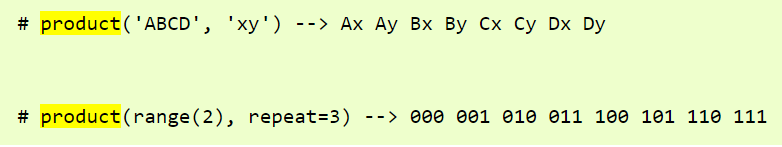

# 一、linux

## 1、磁盘显示没有空间了怎么办？

1、df -h 各个目录所占磁盘使用率

2、sudo rm -rf  ./.local/share/Trash/files/ 删回收站文件

## 2、查询端口是否被使用

sudo lsof -i:3888

1888-9888


## 3、查看文件大小

```javascript
du -h --max-depth=1
```


## 4、xargs

Linux xargs命令：一个给其他命令传递参数的过滤器

将 xargs 解读为乘号（x）和参数（args）的合体

```
#我们用ls命令列出当前路径下的文件, 包括3个文件
[roc@roclinux ~]$ ls
china.txt  usa.txt japan.txt
 
#我们通过xargs + ls的方式列出my.txt文件和your.txt文件
[roc@roclinux ~]$ echo "china.txt usa.txt" | xargs ls
china.txt usa.txt
```


## 5、打开端口

sudo ufw allow 8888


## 6、安全登录Linux的两种方法

1、使用jumpsever跳板机登录

2、密钥对登录

分为公钥和私钥，公钥拖到远程服务器上，登录使用私钥

```shell
#在本地机生成密钥对
ssh-keygen
#通过跳板机登录,切换用户
su jinq
mkdir .ssh
vim .ssh/authorized_keys
#把你的公钥粘贴进去，保存，然后改一下权限
sudo chmod 600 authorized_keys
sudo chmod 700 ~/.ssh
```

## 7、文件夹改名

```
mv aa bbb
```

## 8、crontab手动可执行，定时任务失败

解决办法：代码中不允许有相对路径，只允许绝对路径。


## 9、新账号开户

```
# useradd -d /home/zhuang zhuang //新添加用户zhuang，其home目录为/home/zhuang
//当用户名zhuang登录主机时，系统进入的默认目录为/home/zhuang
```


## 10、删除用户密码

```
sudo passwd -d linux
```


## 11、安装anaconda

```
./Anaconda3-5.3.0-Linux-x86_64.sh
回车
yes
找到 ~/.bashrc
加上 export PATH=/home/anaconda3/bin:$PATH
source ~/.bashrc
```


## 12、jupyter改密码

```
1、在已经安装了anaconda的情况下，可以直接用pip install jupyter安装jupyter notebook

$pip install jupyter

2、生成配置文件：

$jupyter notebook --generate-config

3、修改默认配置文件

$vim ~/.jupyter/jupyter_notebook_config.py
修改配置如下，注意修改完要把注释去掉才能生效啊

c.NotebookApp.ip='your host ip'#10.10.10.10  #可以用hostname -i 或者hostname -I查看,或者host -i，host -I
c.NotebookApp.password = u'sha:ce...刚才复制的那个密文'
c.NotebookApp.open_browser = False
c.NotebookApp.port =8888 #随便指定一个端口，8899等等
c.IPKernelApp.pylab = 'inline'  #这个可能没有，找不到就不用管了

c.NotebookApp.notebook_dir = '/home/'   #设置jupyter启动后默认的文件夹

4、输入jupyter notebook password

5、启动JupyterNotebook

$ jupyter notebook

6、远程访问
```


## 13、新增sudo权限

```
vi /etc/sudoers
## Allow root to run any commands anywhere
root    ALL=(ALL)       ALL
sysadm  ALL=(ALL)       ALL
```


## 14、linux cp命令如何拷贝整个目录下所有文件

```
cp -R /home/usera/. /mnt/temp
```


## 15、GPU的所有使用者和占用情况

```
使用watch -n 2 --color gpustat --c命令GPU的所有使用者和占用情况
注意：如果提示没有安装gpustat,可以通过 pip install gpustat 或 conda install gpustat安装
```

## 16、清空所有进程

在跑Caffe、TensorFlow、pytorch之类的需要CUDA的程序时，强行Kill掉进程后发现显存仍然占用，这时候可以使用如下命令查看到top或者ps中看不到的进程，之后再kill掉：

```
fuser -v /dev/nvidia*
```


1
接着杀掉显示出的进程（有多个）：

```
kill -9 12345
kill -9 12345m
```


1
2
批量清理显卡中残留进程：

```
sudo fuser -v /dev/nvidia* |awk '{for(i=1;i<=NF;i++)print "kill -9 " $i;}' | sudo sh
```


1
清理指定GPU显卡中残留进程，如GPU 2：

```
sudo fuser -v /dev/nvidia2 |awk '{for(i=1;i<=NF;i++)print "kill -9 " $i;}' | sudo sh
```


## 17、删除小于7k的文件

```
find ./ -size -1k -name "*.jpg" | xargs rm
```


## 18、linux批量结束进程

```
跑模型出现异常中断时，有时模型占用的显存不会自动释放，使用nvidia-smi也看不到进程PID。同时多GPU训练产生的进程较多，需要批量删除。

1. ps -ef 查看所有进程
ps -ef
1
2. ps -ef|grep key 筛选出包含"key"关键词的进程
例如想要筛选所有conda的进程，则输入:

ps -ef|grep conda
1


3. awk获取所有筛选出进程的PID
ps -ef|grep conda|awk '{print $2}'
1


4. kill -9 批量删除所有筛选的进程
用xargs将PID传入

ps -ef|grep conda|awk '{print $2}'|xargs kill -9
```


## 19、列出文件大小排序

```
du -l|sort -rn |head
```


## 20、xshell6 修改快捷键与要关闭此消息

只需关闭会话属性/连接/SSH/隧道页面中的X11转发选项


## 21、修改文件夹下全部文件的权限或所属

```
sudo chmod -R 777 filename
sudo chown -R jinq:jinq filename
```


## 22、文件名带特殊字符

文件名为jjj.jpg]

解决方法：

```
rm "jjj.jpg]"
```


## 23、查看端口占用情况

```
Linux 查看端口占用情况可以使用 lsof 和 netstat 命令。

lsof
lsof(list open files)是一个列出当前系统打开文件的工具。

lsof 查看端口占用语法格式：

lsof -i:端口号
实例
查看服务器 8000 端口的占用情况：

# lsof -i:8000
COMMAND   PID USER   FD   TYPE   DEVICE SIZE/OFF NODE NAME
nodejs  26993 root   10u  IPv4 37999514      0t0  TCP *:8000 (LISTEN)
可以看到 8000 端口已经被轻 nodejs 服务占用。

lsof -i 需要 root 用户的权限来执行，如下图：


更多 lsof 的命令如下：

lsof -i:8080：查看8080端口占用
lsof abc.txt：显示开启文件abc.txt的进程
lsof -c abc：显示abc进程现在打开的文件
lsof -c -p 1234：列出进程号为1234的进程所打开的文件
lsof -g gid：显示归属gid的进程情况
lsof +d /usr/local/：显示目录下被进程开启的文件
lsof +D /usr/local/：同上，但是会搜索目录下的目录，时间较长
lsof -d 4：显示使用fd为4的进程
lsof -i -U：显示所有打开的端口和UNIX domain文件
netstat
netstat -tunlp 用于显示 tcp，udp 的端口和进程等相关情况。

netstat 查看端口占用语法格式：

netstat -tunlp | grep 端口号
-t (tcp) 仅显示tcp相关选项
-u (udp)仅显示udp相关选项
-n 拒绝显示别名，能显示数字的全部转化为数字
-l 仅列出在Listen(监听)的服务状态
-p 显示建立相关链接的程序名
例如查看 8000 端口的情况，使用以下命令：
# netstat -tunlp | grep 8000
tcp        0      0 0.0.0.0:8000            0.0.0.0:*               LISTEN      26993/nodejs   
更多命令：

netstat -ntlp   //查看当前所有tcp端口
netstat -ntulp | grep 80   //查看所有80端口使用情况
netstat -ntulp | grep 3306   //查看所有3306端口使用情况
kill
在查到端口占用的进程后，如果你要杀掉对应的进程可以使用 kill 命令：

kill -9 PID
如上实例，我们看到 8000 端口对应的 PID 为 26993，使用以下命令杀死进程：

kill -9 26993
```


## 24、报错NVIDIA-SMI

NVIDIA-SMI has failed because it couldn't communicate with the NVIDIA driver. Make sure that the latest NVIDIA driver is installed and running.

重启服务器之后就出现连接不上NVIDIA驱动的情况。这个时候tensorflow还是可以运行的，但只是在用cpu跑。安装gpu版的TensorFlow时，也显示已安装。

原因：linux服务器重启之后有时候内核更新了，这时候系统会自动更新内核，那么原来的nvidia驱动器的版本就跟不上内核的版本了。自己设置启动内核是一种解决方法，另一种解决办法是更新nvidia驱动

```
step1：sudo apt-get install dkms

step2: sudo dkms install -m nvidia -v 410.79
```


## 25、报错too many links

临时文件夹tmp爆满，一般6.5w个会报错。

解决办法：

```
find /tmp -type f -mtime +1 -delete

rm -rf /tmp/*
```


## 26、cp强制覆盖

```
强制覆盖、替换文件

1、语法： \cp src dest ： 前面增加 反斜杠“\” ， 表示强制覆盖文件。
```


## 27、crontab无反应

解决：python路径改成/home/jinq/usr/bin/python

[(78条消息) crontab 调用python定时任务不执行，原因彻底分析_crontab sh不执行 python_大Py的博客-CSDN博客](https://blog.csdn.net/A_pinkpig/article/details/106425681)


## 28、pip uninstall  不能卸载需要库

这个报错是由于该PyYAML库是通过源代码的方式进行安装，并没有使用pip进行安装，因此pip无法对其进行卸载。出现这个问题的原因可能是之前通过源代码的方式安装了PyYAML库，而现在想要使用pip进行卸载。

解决这个问题，你可以手动将PyYAML库从Python库目录中删除。具体步骤如下：

1. 首先确定你的Python库目录，可以在Python交互环境中输入以下命令查找：

   ```
   python复制代码import site
   print(site.getsitepackages())
   ```

   这个命令会输出一个列表，其中包含了Python库的安装路径。通常情况下，Python库目录应该位于系统的site-packages目录下。

2. 打开Python库目录，查找名为"PyYAML"的文件夹。如果找到了这个文件夹，删除它以卸载PyYAML库。

3. 重新运行Python程序，查看是否已经成功卸载了PyYAML库。

需要注意的是，手动删除Python库中的模块可能会对其他依赖该模块的程序产生影响。因此，在进行这个操作之前，建议备份你的Python库目录。


# 二、python

## 1、交叉并补集

1.  **总结**
    1.1 **求两个list的交、并、差（补)、对称差集 - 使用set集合运算符**
    输入：

```python
a = [0,1,2,3,4]
b = [0,2,6]
list(set(a) & set(b))   # 使用  "&"  运算求a与b的交集，输出：[0, 2]
list(set(a) | set(b))   # 使用  "|"  运算求a与b的并集，输出：[0, 1, 2, 3, 4, 6]
list(set(b) - set(a))   # 使用  "-"  运算求a与b的差(补)集： 求b中有而a中没有的元素，输出：[6]
list(set(a) - set(b))   # 使用  "-"  运算求a与b的差(补)集： 求a中有而b中没有的元素，输出：[1, 3, 4]
list(set(a) ^ set(b))   # 使用  "^"  运算求a与b的对称差集，输出：[1, 3, 4, 6]

```


输出：

```python
求交集：     list(set(a) & set(b))  输出 ->  [0, 2]
求并集：     list(set(a) | set(b))  输出 ->  [0, 1, 2, 3, 4, 6]
求差(补)集： list(set(b) - set(a))  输出 ->  [6]
求差(补)集： list(set(a) - set(b))  输出 ->  [1, 3, 4]
求对称差集： list(set(a) ^ set(b))  输出 ->  [1, 3, 4, 6]
```


1.2 **求两个list的交、并、差（补)、对称差集 - 使用set集合的方法 - 高效率**
输入：

1.2 求两个list的交、并、差（补)、对称差集 - 使用set集合的方法 - 高效率
输入：

```python
a = [0,1,2,3,4]
b = [0,2,6]
list(set(a).intersection(set(b)))  # 使用 intersection 求a与b的交集，输出：[0, 2]
list(set(a).union(b))              # 使用 union 求a与b的并集，输出：[0, 1, 2, 3, 4, 6]
list(set(b).difference(set(a)))    # 使用 difference 求a与b的差(补)集：求b中有而a中没有的元素，输出： [6]
list(set(a).difference(set(b)))    # 使用 difference 求a与b的差(补)集：求a中有而b中没有的元素，输出：[1, 3, 4]
list(set(a).symmetric_difference(b))   # 使用 symmetric_difference 求a与b的对称差集，输出：[1, 3, 4, 6]
```

输出：

```python
求交集：list(set(a).intersection(set(b))          输出 --> [0, 2]
求并集：list(set(a).union(b))                     输出 --> [0, 1, 2, 3, 4, 6]
求差(补)集： list(set(b).difference(set(a))       输出 --> [6]
求差(补)集： list(set(a).difference(set(b)))      输出 --> [1, 3, 4]
求对称差集： list(set(a).symmetric_difference(b)) 输出 --> [1, 3, 4, 6]
```


## 2、pandas三巨头map、apply、applymap

1、map

```
#①使用字典进行映射
data["gender"] = data["gender"].map({"男":1, "女":0})

#②使用函数
def gender_map(x):
    gender = 1 if x == "男" else 0
    return gender
#注意这里传入的是函数名，不带括号
data["gender"] = data["gender"].map(gender_map)
```

2、apply

```
def apply_age(x,bias):
    return x+bias
​
#以元组的方式传入额外的参数
data["age"] = data["age"].apply(apply_age,args=(-3,))
```

3、applymap

针对数据框里面所有值


## 3、Lambda

```
sourcedf['地区']=sourcedf['exam_district'].apply(lambda x:"全国" if x==1 else ("北京" if x==3 else("上海" if x==24 else "其他地区"))  )
```


## 4、pandas三巨头map、apply、applymap

1、map

```
#①使用字典进行映射
data["gender"] = data["gender"].map({"男":1, "女":0})

#②使用函数
def gender_map(x):
    gender = 1 if x == "男" else 0
    return gender
#注意这里传入的是函数名，不带括号
data["gender"] = data["gender"].map(gender_map)
```

2、apply

```
def apply_age(x,bias):
    return x+bias
​
#以元组的方式传入额外的参数
data["age"] = data["age"].apply(apply_age,args=(-3,))
```

3、applymap

针对数据框里面所有值


## 6、itertools内置模块

```
import itertools

#product(iter1,iter2, ... iterN, [repeat=1]);创建一个迭代器，生成表示item1，item2等中的项目的笛卡尔积的元组，repeat是一个关键字参数，指定重复生成序列的次数
```




## 7、logging日志

```js
import logging
# 设置打印日志的级别，level级别以上的日志会打印出
# level=logging.DEBUG 、INFO 、WARNING、ERROR、CRITICAL

# 此处进行Logging.basicConfig() 设置，后面设置无效
logging.basicConfig(level=logging.ERROR)
logging.debug('debug，用来打印一些调试信息，级别最低')
logging.info('info，用来打印一些正常的操作信息')
logging.warning('waring，用来用来打印警告信息')
logging.error('error，一般用来打印一些错误信息')
logging.critical('critical，用来打印一些致命的错误信息，等级最高')
```


## 8、Python 类特殊方法

1、__init__

```python
#初始化参数
class FooBar:
    def __init__(self):
        self.somevar = 42
```

2、__getitem__

```python
#当实例对象通过[] 运算符取值时，会调用它的方法__getitem__
class DataBase:
    '''Python 3 中的类'''

    def __init__(self, id, address):
        '''初始化方法'''
        self.id = id
        self.address = address
        self.d = {self.id: 1,
                  self.address: "192.168.1.1",
                  }

    def __getitem__(self, key):
        # return self.__dict__.get(key, "100")
        return self.d.get(key, "default")
       

data = DataBase(1, "192.168.2.11")
print(data["hi"])
print(data[data.id])
```

3、__len__

```python
#__len__这个方法在类list,dict,set,tuple,str中都存在， 而对象执行len() 时触发了此方法
class Person:
    def __init__(self, *args):  # 不定长参数
        self.names = args
    def __len__(self):
        return len(self.names)
```


## 9、将两个列表合并成一个字典 dict(zip())方法

```python
>>> keys = ['a', 'b', 'c']
>>> values = [1, 2, 3]
>>> dictionary = dict(zip(keys, values))
>>> print(dictionary)
{'a': 1, 'b': 2, 'c': 3}
```


## 10、随机函数random

1、random.random

random.random()用于生成一个0到1的随机符点数: 0 <= n < 1.0

```python
import random
# 生成第一个随机数
print ("random 1 : ", random.random())
```

2、random.uniform

random.uniform的函数原型为：random.uniform(a, b)，用于生成一个指定范围内的随机符点数，两个参数其中一个是上限，一个是下限。如果a > b，则生成的随机数n: b <= n <= a。如果 a <b， 则 a <= n <= b。

```python
import random
print (random.uniform(1, 10))  
print (random.uniform(10, 1))
```

3、random.randint

random.randint()的函数原型为：random.randint(a, b)，用于生成一个指定范围内的整数。其中参数a是下限，参数b是上限，生成的随机数n: a <= n <= b,

```python
import random
print (random.randint(11, 20))  #生成的随机数n: 11 <= n <= 20  
```

4、random.randrange

从指定范围内，按指定基数递增的集合中 获取一个随机数

```python
import random
print (random.randrange(10, 18, 2))
```

5、random.choice

从序列中获取一个随机元素。

```python
import random
print (random.choice("Pythontab.com"))
print (random.choice(["python", "tab", "com"]))
```

6、random.shuffle

用于将一个列表中的元素打乱。

```python
import random
list = [1, 2, 3, 4, 5, 6, 7, 8, 9, 10]
random.shuffle(list)
```

7、random.sample

从指定序列中随机获取指定长度的片断。

```python
mport random
list = [1, 2, 3, 4, 5, 6, 7, 8, 9, 10]  
slice = random.sample(list, 5)  #从list中随机获取5个元素，作为一个片断返回  
print (slice) 
```

8、一定的概率进行某项操作：

```
if np.random.uniform(0, 1)<0.5:
else:
```


## 11、去掉字符串的数字

```python
string = 'abcd1234efg567'
newstring = ''.join([i for i in string if not i.isdigit()])
print(newstring)
```


## 12、列表对应元素相减

```python
v = list(map(lambda x: x[0]-x[1], zip(v2, v1)))

c = [a[i]+b[i] for i in range(0,len(a))] #range后还可以加if条件筛选
```


## 13、python 取列表（数组）偶数和奇数位置的值

```python
l=['28', '7', '55', '0', '82', '3', '9', '4', '92', '9', '54', '7', '19', '4', '36', '6']
print(f'奇数位：{l[::2]}\n偶数位：{l[1::2]}')
结果：
奇数位：['28', '55', '82', '9', '92', '54', '19', '36']
偶数位：['7', '0', '3', '4', '9', '7', '4', '6']
```

## 14、@staticmethod

```python
#使其可以在不创建类实例的情况下调用方法
class Time():
    def __init__(self,sec):
        self.sec = sec
    #声明一个静态方法
    @staticmethod
    def sec_minutes(s1,s2):
        #返回两个时间差
        return abs(s1-s2)

t = Time(10)
#分别使用类名调用和使用实例调用静态方法
print(Time.sec_minutes(10,5),t.sec_minutes(t.sec,5))
#结果为5 5
```


## 15、python用 GET,POST,PUT

```
 . GET     - 向特定的资源发出请求。
                 注意：GET方法不应当被用于产生“副作用”的操作中，例如在web app.中。
                 其中一个原因是GET可能会被网络蜘蛛等随意访问。
 . POST    - 向指定资源提交数据进行处理请求（例如提交表单或者上传文件）。
                 数据被包含在请求体中。POST请求可能会导致新的资源的建立和/或已有资源的修改。
 . PUT     - 向指定资源位置上传其最新内容。
```


## 16、多线程

1、自动化多线程

```python
#apply_async,适用于cpu
from tqdm.auto import tqdm as tn
import multiprocessing

def print_error(value):
    print('bug:',value)

pool = multiprocessing.Pool(processes=13)
for idx in tn(df.index):
    filepath = df.loc[idx, 'filepath']
    folder_num = idx % 5
    savepath = f'./data/10W_check_project/100W_task1_people{folder_num}/'
    pool.apply_async(copy_file, (filepath, savepath),error_callback=print_error)
    #一个参数时要加逗号（i,）
pool.close()
pool.join()
```

注意：

1）一个参数时要加逗号

2）必须自己写报错函数，不然不会返回报错


2、半自动化多线程

```python
from idcard_recognition import IDCardRecognition
import time
import os
import glob
from PIL import Image
import torch
from tqdm.auto import tqdm as tn
import multiprocessing
import numpy as np
from multiprocessing import Process
multiprocessing.set_start_method('spawn', True)

def id_det(i):
    address_det = '/home/jinq/ava/my_models/身份证地址造假v2/data/normal_det/'
    name_det = '/home/jinq/ava/my_models/身份证姓名字体造假v2/data/normal_det/'
    patch, w, side, module = model.get_img_patchs(f'/home/jinq/tags_project/分析/icd_normal/{i}')
    #address
    address = patch.get('address')
    if address is not None:
        aa = model.get_text_patchs(address)[0]
        for j in range(len(aa)):
            img = Image.fromarray(aa[j])
            img.save(f'{address_det}{i}')

        #name
        name = patch.get('name')
        aa = model.get_text_patchs(name)[0]
        for j in range(len(aa)):
            img = Image.fromarray(aa[j])
            img.save(f'{name_det}{i}')
def print_error(value):
    print('bug:',value)
    
def run2(imgs):
    model = IDCardRecognition(dev=3)
    for i in tn(imgs):
        id_det(i)

if __name__ == '__main__':
files = os.listdir('/home/jinq/tags_project/分析/icd_normal/')
kn = 8
ds = np.split(files[49751:], np.linspace(0, len(files[49751:]), kn + 1, dtype=int)[1:-1])
ps = []
for i in range(kn):
    p = Process(target=run2, args=(ds[i], ))
    p.start()
for p in ps:
    p.join()
```

注意：必须写py文件，定义\__main__运行.

3、监控

```python
for i in tn(range(1000)):
    aaa = !ls -lR data/10W_check_project/ | wc -l
    aaa = int(aaa[0])
    print(f'已完成:{aaa}, {aaa / 3159766 * 100}')
    time.sleep(2)
```


## 17、sys路径

```
import os,sys
now_dir = os.path.dirname(__file__)#当前绝对路径
if not now_dir in sys.path:
	sys.path.append(now_dir)#加入当前路径
```


## 18、复杂筛选技巧

```
df[df['bb'].map(lambda x:x[1])]
```


## 19、staticmethod() 

以上实例声明了静态方法 **f**，从而可以实现实例化使用 **C().f()**，当然也可以不实例化调用该方法 **C.f()**。

```
class C(object):
    @staticmethod
    def f():
        print('runoob');
 
C.f();          # 静态方法无需实例化
cobj = C()
cobj.f()        # 也可以实例化后调用
```


## 20、classmethod和staticmethod的区别和使用场景

声明时：

classmethod的第一个参数为类本身(cls)，正如实例方法的第一个参数为对象本身(self);
staticmethod第一个参数不需要传入cls或self，故staticmethod中是无法访问类和对象的数据的。
调用时：

都可用类名直接调用

```
class Test:
    @classmethod
    def f1(cls, info):
        print(info)

    @staticmethod
    def f2(info):
        print(info)
 
In [2]: Test.f1('hi')
hi

In [3]: Test.f2('hello')
hello

In [4]: t = Test()

In [5]: t.f1('hi')
hi

In [6]: t.f2('hello')
hello
```


## 21、批量文件改名

```
import os
path=input('请输入文件路径(结尾加上/)：')       

#获取该目录下所有文件，存入列表中
fileList=os.listdir(path)

n=0
for i in fileist:
    
    #设置旧文件名（就是路径+文件名）
    oldname=path+ os.sep + fileList[n]   # os.sep添加系统分隔符
    
    #设置新文件名
    newname=path + os.sep +'a'+str(n+1)+'.JPG'
    
    os.rename(oldname,newname)   #用os模块中的rename方法对文件改名
    print(oldname,'======>',newname)
    
    n+=1
```


## 22、运行python脚本时传入参数的几种方式

```
1.sys.argv

sys模块是很常用的模块， 它封装了与python解释器相关的数据，例如sys.modules里面有已经加载了的所有模块信息，sys.path里面是PYTHONPATH的内容，而sys.argv则封装了传入的参数数据。
使用sys.argv接收上面第一个命令中包含的参数方式如下：

import sys
gpus = sys.argv[1]
#gpus = [int(gpus.split(','))]
batch_size = sys.argv[2]
print(gpus)
print(batch_size)

2.argparse

复制代码
import argparse
parser = argparse.ArgumentParser(description='manual to this script')
parser.add_argument("--gpus", type=str, default="0")
parser.add_argument("--batch-size", type=int, default=32)
args = parser.parse_args()
print(args.gpus)
print(args.batch_size)

复制代码
需要注意的是，脚本运行命令python script.py -gpus=0,1,2 --batch-size=10中的--batch-size会被自动解析成batch_size.
parser.add_argument 方法的type参数理论上可以是任何合法的类型， 但有些参数传入格式比较麻烦，例如list，所以一般使用bool, int, str, float这些基本类型就行了，更复杂的需求可以通过str传入，然后手动解析。bool类型的解析比较特殊，传入任何值都会被解析成True，传入空值时才为False
```


## 22、eval 函数使用报错 name 'false' is not defined

```
推荐使用   false = False，null = Null ,true = Ture

【ps：如果封装 成函数时，可以使用global声明】
```


## 23、多层字段转数据框

```
pd.DataFrame.from_dict({(i, j): nested_dict[i][j]
                                                 for i in nested_dict.keys()
                                                 for j in nested_dict[i].keys()},
                                         orient='index')
```


## 24、列表中包含有相同类型的字典

```
# 对a按照t的下标大小进行排序
a.sort(key=lambda s: int(s["name"][1:]))
print(a)
```


## 25、分布变成正太分布

https://blog.csdn.net/BF02jgtRS00XKtCx/article/details/108612854


# 三、Numpy专栏

## 1、numpy增加维度、删除维度

```
numpy .squeeze (a, axis=None)squeeze () 函数 的功能是：从矩阵shape中， 去掉维度 为1的。 例如一个矩阵是的shape是（5， 1），使用过这个 函数 后，结果为（5，）。 参数： a是输入的矩阵 axis : 选择shape中的一维条目的子集。 如果在shape大于1的情况下设置axis，则会引发错误。 栗子： 要使用 numpy 先导入 numpy 库 import nump numpy数组 的 维度 操作方法，np.expand_dims ()增加 维度 ，np.squeeze ()压缩 维度。
```


# 四、其他事情

## 1、舆情监控

[Jupyter/2020年7月13日-产品舆情监控/models/ (xwfintech.com)](https://aitech.xwfintech.com/spider/tree/Jupyter/2020年7月13日-产品舆情监控/models)

[config.xlsx](https://aitech.xwfintech.com/spider/edit/Jupyter/2020年7月13日-产品舆情监控/models/config.xlsx)配置文件

[online_monitor_v2.py](https://aitech.xwfintech.com/spider/edit/Jupyter/2020年7月13日-产品舆情监控/models/online_monitor_v2.py)运行主文件


## 2、Typora编辑器在linux的安装

```
[root@localhost tools]# tar zxf Typora-linux-x64.tar.gz学习

[root@foundation60 tools]# ls
Typora-linux-x64 Typora-linux-x64.tar.gz操作系统

[root@foundation60 tools]# cd Typora-linux-x64/文档

[root@foundation60 Typora-linux-x64]# ./Typorait

#执行完以后，在没有错误的状况下，就安装完成了，会出现Typora的编辑页面io

为了方便使用，能够建立一个软链接以下：
[root@foundation60 Typora-linux-x64]# ln -s /tools/Typora-linux-x64/Typora /root/Desktop/class

此时桌面上就会出现一个快捷方式，之后每次编辑文档只须要点击快捷窗口就能够了。
```


## 3、vscode dubug

（1）问题：vscode报错：配置初始化错误

解决办法：debug只能对单线程，把worker改成0


（2）问题：调试时要进入函数，自动补全

解决办法：在最外层打点，单补调试，在函数内层打点，直到进入最内层。按tab键自动补全。


（3）报错[VSCode](https://so.csdn.net/so/search?q=VSCode&spm=1001.2101.3001.7020) ssh Server卡在Setting up SSH Host XX: Downloading VS Code Server

解决办法：使用VSCode Remote-SSH插件，想连接远程的华为GPU服务器，但就是无法连接上，以前其他的服务器连接没有出现过这种情况。

发现是因为服务器端会下载vscode-server-linux-x64.tar.gz这个文件，但如果无法连接外网，又没设置代理的情况下，是无法下载的，所以一直卡在Downloading VS Code Server.

```
https://update.code.visualstudio.com/commit:30d9c6cd9483b2cc586687151bcbcd635f373630/server-linux-x64/stable

rm ~/.vscode-server/bin/* -rf
mkdir -p ~/.vscode-server/bin

cd ~/.vscode-server/bin
tar -zxf vscode-server-linux-x64.tar.gz
mv vscode-server-linux-x64 30d9c6cd9483b2cc586687151bcbcd635f373630
```


# 五、windows命令行

## 1、进入d盘

d:

## 2、展示文件

dir

## 3、本地服务器文件管理工具 everything

1、工具-选项-NTFS-取消包含到数据库

2、HTTP-启用-端口-用户名密码

3、文件夹-选入


# 六、jupyter notebook常见问题

jupyter notebook可能的原因？

1. 多个ip地址时，限定--ip 0.0.0.0
2. 
