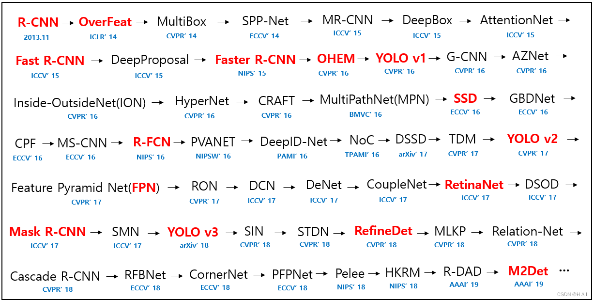
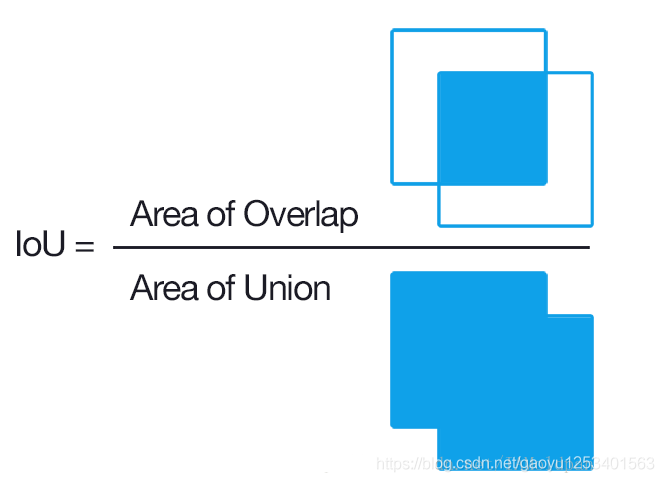

# 目标检测

## 一、定义

目标检测（Object Detection）的任务是找出图像中所有感兴趣的目标（物体），确定它们的类别和位置。

两步走的目标检测：先进行区域推荐，而后进行目标分类
包含一个用于区域提议的预处理步骤，使得整体流程是两级式的。代表：R-CNN、SPP-Net、Fast R-CNN、Faster R-CNN和R-FCN等

端到端的目标检测：直接在网络中提取特征来预测物体分类和位置
即无区域提议的框架，这是一种单独提出的方法，不会将检测提议分开，使得整个流程是单级式的。代表：OverFeat、YOLOv1、YOLOv2、YOLOv3、SSD和RetinaNet等

分类：
N个类别
输入：图片
输出：类别标签
评估指标：Accuracy

定位：
N个类别
输入：图片
输出：物体的位置坐标
主要评估指标：IOU

其中我们得出来的(x,y,w,h)有一个专业的名词，叫做bounding box(bbox).

物体位置：
x, y, w,h:x,y物体的中心点位置，以及中心点距离物体两边的长宽
xmin, ymin, xmax, ymax：物体位置的左上角、右下角坐标。

## 二、常见指标

### 1. IOU

(Intersection over Union)，只要是在输出中得出一个预测范围(bounding boxex)的任务都可以用IoU来进行测量。这个标准用于测量真实和预测之间的相关度，相关度越高，该值越高。如下图所示。绿色标线是人为标记的正确结果（ground-truth），红色标线是算法预测的结果（predicted）。

### 2. bounding box(bbox)

物体位置：
x, y, w,h:x,y物体的中心点位置，以及中心点距离物体两边的长宽
xmin, ymin, xmax, ymax：物体位置的左上角、右下角坐标。

- Ground-truth bounding box：图片当中真实标记的框

- Predicted bounding box：预测的时候标记的框

  

## 三、常见轻量级目标检测方法

### YOLO Nano

YOLO Nano是一个高度紧凑的网络，它是一个基于YOLO网络的8位量化模型，并在PASCAL VOC 2007数据集上进行了优化。模型大小在4M左右，在计算上需要4.57B推算，性能表现上，在VOC 2007数据集上得到了69.1%的mAP。该网络非常适合边缘设备与移动端的实时检测。

论文地址：https://arxiv.org/abs/1910.01271

代码地址：GitHub - liux0614/yolo_nano: Unofficial implementation of yolo nano

### **NanoDet**

NanoDet是一款超快速、高精度、anchor-free的轻量级检测网络，可实现在移动设备上的实时运行。主要面向工程应用，暂未有论文发表。

 工程链接：GitHub - RangiLyu/nanodet: NanoDet-Plus

该网络具有如下特性：

超轻量级：模型文件只有0.98MB(INT8)或1.8MB(FP16)；
推理速度快：在移动ARM CPU上可达到97fps，即每帧10.23ms的推理速度；
高精度：CPU实时推理下最高可达34.3 mAPval@0.5:0.95；
训练友好：比其他模型具有明显小的GPU memory消耗，在GTX1060 6G0上可做到batch-size=80；
方便部署：支持各种后端，包括ncnn、MNN和OpenVINO。并且提供了基于ncnn推理框架的Android演示。
NanoDet-Plus在NanoDet基础上进行了更进一步的优化，增加了AGM(Assign Guidance Module) 和DSLA(Dynamic Soft Label Assigner)模块，使精度在COCO dataset上有了7个点的 mAP提升(与NanoDet相比提升了30%左右)，且使得训练和部署更容易。
### YOLOX-Nano

YOLOX是在YOLO系列的基础上进行了若干改进生成的新的高性能检测器。要点包括：(1) Anchor-free的检测方式；(2) 检测头解耦；(3) 先进的标签分配策略SimOTA；(4)强数据增广；(5) Multi positives。其中，YOLOX-Nano只有0.91M的参数量和1.08G FLOPs，在COCO数据集上获得了25.3%的mAP，比NanoDet高1.8% mAP。

论文地址：https://arxiv.org/abs/2107.08430

代码地址：https://github.com/Megvii-BaseDetection/YOLOX

### 华为GhostNet

GhostNet通过Ghost模块构建高效的神经网络结构，从而减少神经网络的计算成本。Ghost模块将原始卷积层分为两部分，首先使用较少的卷积核来生成原始特征图，然后，进一步使用廉价变换操作以高效生产更多幻影特征图。在基准模型和数据集上进行的实验表明，该方法是一个即插即用的模块，能够将原始模型转换为更紧凑的模型，同时保持可比的性能。此外，在效率和准确性方面，使用提出的新模块构建的GhostNet均优于最新的轻量神经网络，如MobileNetV3。

论文地址：https://arxiv.org/pdf/1911.11907.pdf

代码地址：[GhostNet](https://github.com/huawei-noah/ghostnet)

### YOLOv5

代码地址：YOLOv5

YOLOv5是一系列目标检测架构的合集，其高精度、低耗时、易训练、易部署、好上手等特点，让YOLOv5的热度一举超过YOLOv4，成为当前目标检测界的主流。并且作者也一直在维护，新版本精度越来越高、速度越来越快、模型越来越小，截至目前为止，YOLOv5已经迭代到了第六个版本。为了应对移动端的部署应用，作者推出了YOLOv5的n版本，其参数量只有1.9M，在COCO val2007 dataset上的mAP精度也达到了28.4，而YOLOv5n6在YOLOv5n的基础上，mAP又有所提升，达到了34，同时模型参数量提升到3.2M。

### PP-PicoDet

PP-PicoDet是基于百度PaddleDetection提出的面向移动端和CPU的轻量级检测模型，在移动设备上具有卓越的性能，成为全新的SOTA轻量级模型，并且一直在更新维护，最新的版本发布于2022年3月20日。

论文地址：https://arxiv.org/abs/2111.00869

工程链接：PaddlePaddle/PaddleDetection

PP-PicoDet模型具有如下特点：

更高的mAP，参数量在1M以内，在输入像素416x416时，mAP超过30；
更快的预测速度，在ARM CPU上可达到150FPS；
部署友好，支持PaddleLite、MNN、MCNN、OpenVINO等平台，支持转换ONNX，并且提供了C++/Python/Android的Demo；
算法创新，在现有SOTA算法上进行了优化，包括ESNet、CSP-PAN、SimOTA等。
