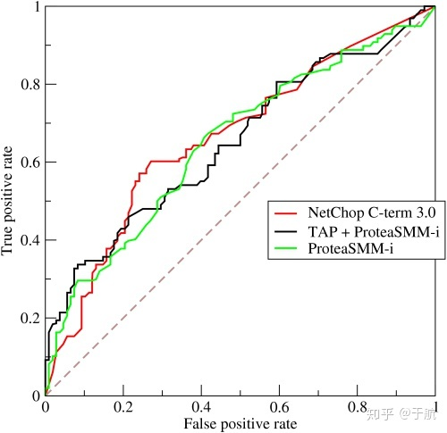

## 一、评价指标

1. 准确率（Accuracy）：准确率是最常用的评价指标之一，它表示模型在测试集上的分类准确率。准确率的计算方法是将预测正确的样本数除以总样本数。
2. 精确率（Precision）：精确率是指分类器预测为正类的样本中，实际为正类的样本占预测为正类的样本的比例。精确率的计算方法是将真正类数除以真正类数加上假正类数。
3. 召回率（Recall）：召回率是指实际为正类的样本中，分类器预测为正类的样本占实际为正类的样本的比例。召回率的计算方法是将真正类数除以真正类数加上假负类数。
4. F1分数（F1 Score）：F1分数是精确率和召回率的调和平均数。F1分数越高，说明模型的性能越好。F1分数的计算方法是2 * (precision * recall) / (precision + recall)。
5. ROC曲线和AUC值：ROC曲线是二分类问题中常用的评价指标，它可以用来比较不同模型的性能。ROC曲线是将分类器在**不同阈值**下的真正类率（TPR）和假正类率（FPR）绘制出来的曲线。AUC是ROC曲线下面积，它可以用来表示模型的整体性能。AUC也可以理解为分别随机从政府样本集中抽取一个正负样本，正样本的预测值大于负样本的概率。
6. 损失函数（Loss Function）：损失函数是用来评估模型在训练数据上的误差大小。训练模型的过程就是最小化损失函数的过程。常见的损失函数有交叉熵损失函数、均方误差损失函数等。
7. 学习曲线（Learning Curve）：学习曲线是指模型在不同训练集大小下的训练误差和测试误差的变化曲线。学习曲线可以用来评估模型是否存在过拟合或欠拟合的问题，从而选择最优的模型。
8. 混淆矩阵（Confusion Matrix）：混淆矩阵是用来评估分类器在不同类别上的表现。混淆矩阵的每一行代表真实的类别，每一列代表预测的类别。通过混淆矩阵可以计算出准确率、精确率、召回率等指标。
9. 平均精度（Average Precision）：平均精度是指分类器在不同类别上的平均精度值。平均精度通常用于计算目标检测或图像分割任务中的性能。

注意：

这些评价指标的选择要根据具体问题和应用场景来决定，同时还需要考虑模型的可解释性、泛化性、速度等因素。通常在选择评价指标的时候，需要综合考虑多个指标，而不是仅仅考虑一个指标。

以上指标的原理都是用来评估模型在训练数据集上的性能，从而选择最佳的模型。不同指标的选择要根据具体的问题和应用场景来决定。例如，对于二分类问题，可以使用准确率、精确率、召回率、F1分数和ROC曲线等指标来评估模型性能；对于多分类问题，可以使用混淆矩阵、准确率和F1分数等指标来评估模型性能。

## 二、应用场景和对应的评价指标

1. 分类问题：准确率、精确率、召回率、F1值、AUC-ROC等。

2. 回归问题：均方误差、均方根误差、平均绝对误差、R2得分等。

3. 目标检测问题：平均精度、召回率、平均定位误差、漏检率等。

4. 图像分割问题：像素准确率、像素精确率、像素召回率、像素F1值、IOU等。

5. 文本生成问题：困惑度、BLEU得分、ROUGE-L得分、METEOR得分等。

## 三、原理简介

1. 准确率：分类正确的样本数除以总样本数。

2. 精确率：指的是在所有被分类为正例的样本中，真正为正例的样本所占的比例。

3. 召回率：指的是在所有实际为正例的样本中，被分类为正例的样本所占的比例。

4. F1值：是精确率和召回率的调和平均值，综合反映了分类器的性能。

5. AUC-ROC：ROC曲线下的面积，表示分类器将正例排在负例前面的能力。AUC也可以理解为分别随机从政府样本集中抽取一个正负样本，正样本的预测值大于负样本的概率。

   

6. 均方误差：预测值与真实值之间差值的平方的均值。

7. 均方根误差：均方误差的平方根，反映了预测值和真实值之间的平均差距。

8. 平均绝对误差：预测值与真实值之间差值的绝对值的平均值。

9. R2得分：R2得分描述了模型对于总方差中可解释部分的解释程度，取值范围为0到1。

10. IOU：交并比，表示预测的区域和真实区域的交集与并集的比例。

11. NMS：非极大值抑制，对于目标检测问题，为了提高召回率，在模型计算中间过程会生成许多候选框(bounding box)，使用NMS从堆叠的边框中挑出最好的一个。

12. fps：检测器每秒能处理图片的张数

13. FLOPs检测器处理每张图片所需要的浮点操作数

14. BLEU得分：句子的n-gram重合度，用于衡量自动生成句子的质量。

15. ROUGE-L得分：计算预测句子和真实句子的最长公共子序列的长度，用于衡量摘要生成的质量。

16. METEOR得分：基于精确度和召回率的加权几何平均数，用于衡量机器翻译的质量。

评价指标的选择要根据具体的应用场景和任务需求，不同的指标能够从不同角度反映模型的性能。因此，在模型评估和比较时，需要根据实际需求进行综合考虑。