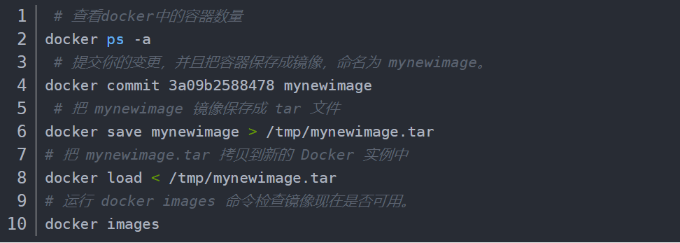

### docker相关

#### 1、启动        

systemctl start docker

systemctl start docker.service

#### 2、守护进程重启   

sudo systemctl daemon-reload

#### 3、重启docker服务   

systemctl restart  docker

#### 4、重启docker服务  

sudo service docker restart

#### 5、关闭

docker service docker stop


### 容器生命周期管理

#### 1、run

**docker run ：**创建一个新的容器并运行一个命令

#### 2、start/stop/restart

**docker start** :启动一个或多个已经被停止的容器

**docker stop** :停止一个运行中的容器

**docker restart** :重启容器

#### 3、kill

**docker kill** :杀掉一个运行中的容器

#### 4、rm

**docker rm ：**删除一个或多个容器。

#### 5、pause/unpause

**docker pause** :暂停容器中所有的进程。

**docker unpause** :恢复容器中所有的进程。

#### 6、create

**docker create ：**创建一个新的容器但不启动它

#### 7、exec

**docker exec ：**在运行的容器中执行命令


### docker镜像打包




### 工作中使用的命令

#### 1、需要jupyter notebook

docker容器里打开jupyter notebook

```ruby
##外部容器
sudo docker run -it -p 8888:8888 -v $PWD:/workspace --name `容器名` '镜像名' 
##内部容器
jupyter notebook --ip 0.0.0.0 --allow-root --port 8888 --no-browser
token内带

#设置密码
jupyter notebook password
```


#### 2、正常进入容器

docker exec -it 容器id或容器名 /bin/bash


#### 3、Docker 容器启动失败,提示IPv4 forwarding is disabled. Networking will not work.

```
vim /etc/sysctl.config
# 增加如下配置 如果该文件已有该配置,从0改为1即可 0为禁用ip转发 1为允许
net.ipv4.ip_forward=1
# 重启network
systemctl restart network
```


4、通过跳板机连接远程jupyter

```
直接打开cmd，
假设目的主机jupyter端口为8900，则
输入“ssh -g -L 8900:目的主机ip:8900 跳板机用户名@跳板机ip”，
回车然后输入跳板机用户对应的密码登录。
本地浏览器输入“localhost:8900”就可以访问目的主机的jupyter了。
```

