# 激活函数

**激活函数**能为神经网络引入非线性，常见的激活函数根据设计思路分类如下：

- **S**型激活函数：形如**S**型曲线的激活函数。包括**Step**，**Sigmoid**，**HardSigmoid**，**Tanh**，**HardTanh**
- **ReLU**族激活函数：形如**ReLU**的激活函数。包括**ReLU**，**Softplus**，**ReLU6**，**LeakyReLU**，**PReLU**，**RReLU**，**ELU**，**GELU**，**CELU**，**SELU**
- 自动搜索激活函数：通过自动搜索解空间得到的激活函数。包括**Swish**，**HardSwish**，**Elish**，**HardElish**，**Mish**
- 基于梯度的激活函数：通过梯度下降为每个神经元学习独立函数。包括**APL**，**PAU**，**ACON**，**PWLU**，**OPAU**，**SAU**，**SMU**
- 基于上下文的激活函数：多输入单输出函数，输入上下文信息。包括**maxout**，**Dynamic ReLU**，**Dynamic Shift-Max**，**FReLU**

它们将非线性特性引入到我们的网络中。激活函数可以分为饱和激活函数与不饱和激活函数，激活函数的右饱和指当x xx趋向于正无穷时，函数的导数趋近于0。

## Sigmoid函数

是一个在生物学中常见的S型函数，由于其单增以及反函数单增等性质，Sigmoid函数常被用作神经网络的激活函数，将变量映射到[ 0 , 1 ] [0, 1][0,1]之间。

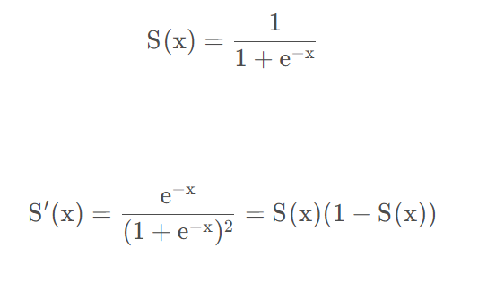

****

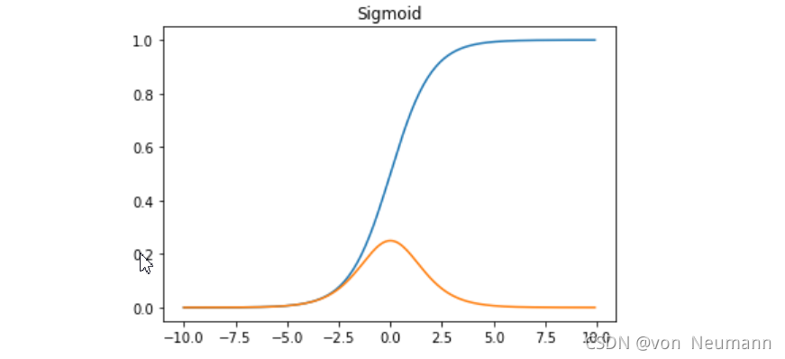

## tanh函数

双曲正切函数在数学语言上一般写作tanh ⁡ \tanhtanh。它解决了Sigmoid函数的不以0为中心输出问题，然而，梯度消失的问题和幂运算的问题仍然存在。
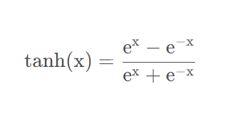

## ReLU函数

是一种人工神经网络中常用的激活函数

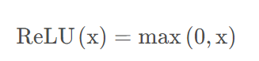

## Leaky ReLU函数

它是一种专门设计用于解决Dead ReLU问题的[激活函数](https://so.csdn.net/so/search?q=激活函数&spm=1001.2101.3001.7020)：

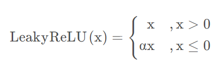

## ELU函数

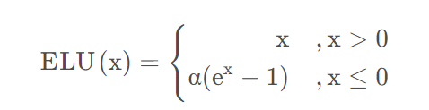

## PReLU 函数

也是 ReLU 的改进版本

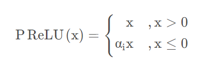

## softmax

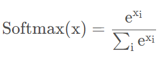

## swish

self-gating的优点在于它只需要简单的标量输入，而普通的gating则需要多个标量输入。这使得诸如Swish之类的self-gated激活函数能够轻松替换以单个标量为输入的激活函数（如：ReLU），而无需更改隐藏容量或参数数量。

Swish函数的特点

有助于防止慢速训练期间，梯度逐渐接近0并导致饱和
导数恒大于0。
平滑度在优化和泛化中起了重要作用。
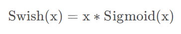

## Maxout函数

它可以理解为是神经网络中的一层网络，类似于池化层、卷积层一样。我们也可以把Maxout函数看成是网络的激活函数层

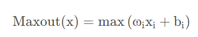

## Softplus函数

Softplus函数可以看作是ReLU函数的平滑。根据神经科学家的相关研究，Softplus函数和ReLU函数与脑神经元激活频率函数有神似的地方。也就是说，相比于早期的激活函数，Softplus函数和ReLU函数更加接近脑神经元的激活模型，而神经网络正是基于脑神经科学发展而来，这两个激活函数的应用促成了神经网络研究的新浪潮。

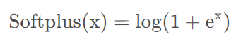

## Softsign函数

Softsign函数是Tanh函数的另一个替代选择。就像Tanh函数一样，Softsign函数是反对称、去中心、可微分，并返回-1和1之间的值。其更平坦的曲线与更慢的下降导数表明它可以更高效地学习，比tTanh函数更好的解决梯度消失的问题。另一方面，Softsign函数的导数的计算比Tanh函数更麻烦。

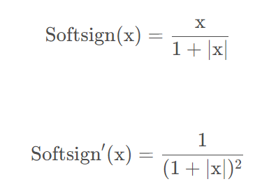

## 高斯误差线性单元为Gaussian Error Linerar Units

高斯误差线性单元为Gaussian Error Linerar Units，来源于论文《Gaussian Error Linear Units (GELUs)》。在神经网络的建模过程中，模型很重要的性质就是非线性，同时为了模型泛化能力，需要加入随机正则，例如dropout(随机置一些输出为0,其实也是一种变相的随机非线性激活)，而随机正则与非线性激活是分开的两个事情， 而其实模型的输入是由非线性激活与随机正则两者共同决定的。

高斯误差线性单元正是在激活中引入了随机正则的思想，是一种对神经元输入的概率描述，直观上更符合自然的认识，同时实验效果要比ReLU与ELU都要好。

GELUs其实是dropout、zoneout、ReLU的综合，GELU对于输入乘以一个[ 0 , 1 ] [0,1][0,1]组成的mask，而该mask的生成则是依概率随机的依赖于输入。假设输入为X XX, mask为m mm，则m mm服从一个伯努利分布Φ ( x ) = P ( X < x ) \Phi(x)=P(X<x)Φ(x)=P(X<x)，其中X XX服从标准正态分布。这么选择是因为神经元的输入趋向于正态分布，这么设定使得当输入x xx减小的时候，输入会有一个更高的概率被dropout掉，这样的激活变换就会随机依赖于输入了。

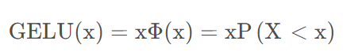